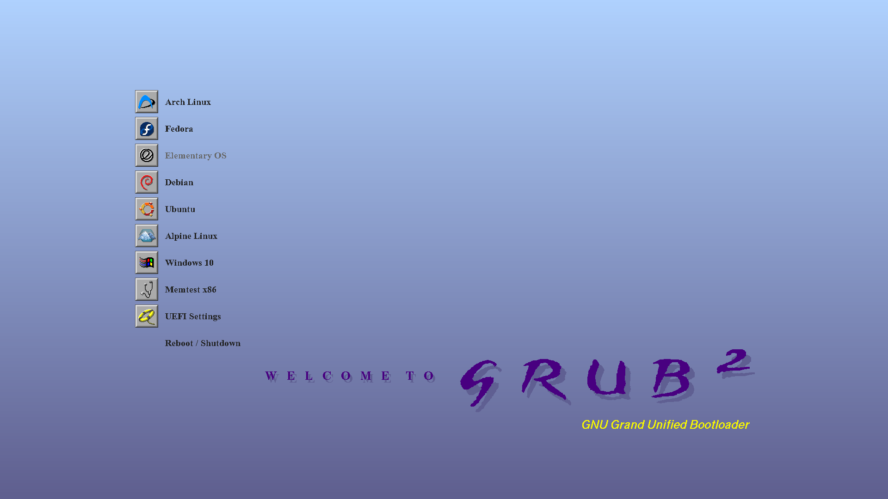
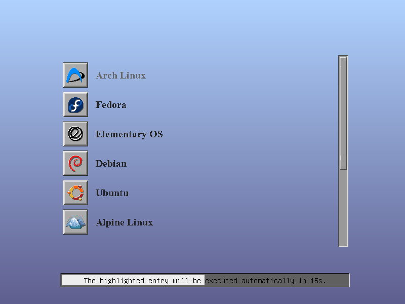
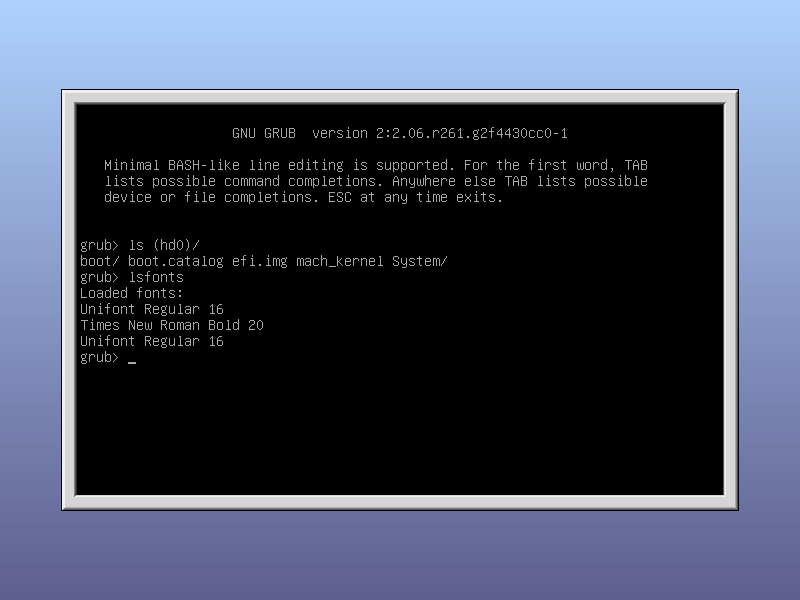

# SGI-esque GRUB 2 Theme

A pretty retro GRUB theme inspired by the boot up visuals on Silicon Graphics systems like the Indy.

----

## HOWTO
1. Determine if you want to use 1080p or a higher resoultion for GRUB. Keep in mind that using a higher resolution may result in high console input latency on some machines.
    * **You want to use >=1080p:** Delete the beginning hash/number symbol from `SGI/theme.txt`, lines 48 - 54. Then follow additional instructions in step 3.
    * **You DON'T want to use >=1080p:** Leave the files be.
2. Copy the `SGI` folder into your GRUB's themes directory, e.g. `/boot/grub/themes/`. You may need root privileges.
3. Set `GRUB_THEME` in your GRUB configuration (e.g. in `/etc/default/grub`) to point to the newly-copied directory.
    * **IF you want to use >=1080p:** Make sure `GRUB_GFXMODE=1920x1080`.
4. Rebuild the GRUB configuration. (e.g. `grub-mkconfig -o /boot/grub/grub.cfg`)

----

